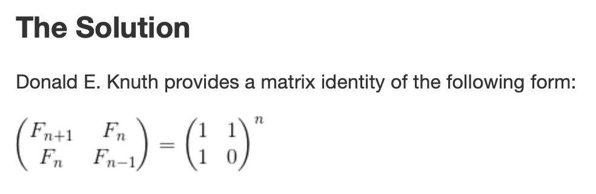

ДЗ:
1) Реализовать алгоритм быстрого возведения программно, протестировать его.
2) Написать алгоритм получения N-того числа Фибоначчи за log(n).
3) Написать алгоритм генерации подстановок в лексикографическом порядке, оценить его сложность.
4) а)Упростить O(n^n + n! + e^n + n^e). б)Упростить O(x^2*e^n + ye^k + n + k^n) от n,y,k
5) Написать алгоритм проверки числа на простоту.
6) Где реально нужно знание алгоритмов? Оригинал:
http://cstheory.stackexchange.com/questions/19759/core-algorithms-deployed
Перевод: https://habrahabr.ru/company/wunderfund/blog/277143/
7) Алгоритмы и матан хорошо себя рекомендуют, когда есть ограничения железа, например:
https://habrahabr.ru/post/337036/
8) Какие алгоритмы и структуры данных пригодятся, если вы хотите пройти интервью от гугла: https://github.com/jwasham/coding-interview-university
9) Визуализация алгоритмов: http://algo-visualizer.jasonpark.me/ или https://visualgo.net
10) Разъяснение оценки сложности «на пальцах» + тест на знание (местами беда с терминами, но для практики отлично подходит): https://ulearn.me/Course/complexity
11) Поверхностное объяснение некоторых структур и алгоритмов: https://github.com/trekhleb/javascript-algorithms

Решение:
## 1

Реализовать алгоритм быстрого возведения программно, протестировать его.

```cpp
#include <iostream>

long int _power_ (long int base, long int power) {
    if (power == 0)
        return 1;
    if (power % 2 == 0)
    {
        long int temp = _power_(base, power/2);
        return temp*temp;
    }
    else
    {
        long int temp = _power_(base, power/2);
        return temp*temp*base;
    }
}

int main() {
    long int a,b;
    std::cin >> a >> b;
    std::cout << _power_(a,b);
}

```

## 2 

Написать алгоритм получения N-того числа Фибоначчи за log(n).

[link](https://kukuruku.co/post/the-nth-fibonacci-number-in-olog-n/)



## 3 

Написать алгоритм генерации подстановок в лексикографическом порядке, оценить его сложность.

[link](https://habr.com/ru/post/428552/)

O(n + log(n))

## 4 

a) O(n^n + n! + e^n + n^e)

n = 2 

2^2 + 2! + e^2 + 2^e = 4 + 2 + 6,5 + 7,3

n = 10 

... = 10b + 3,6m + 22k + 522

=> O(n^n + n! + e^n + n^e) = O(n^n)

b) O(x^2*e^n + ye^k + n + k^n) от n,y,k

## 5 Написать алгоритм проверки числа на простоту.


